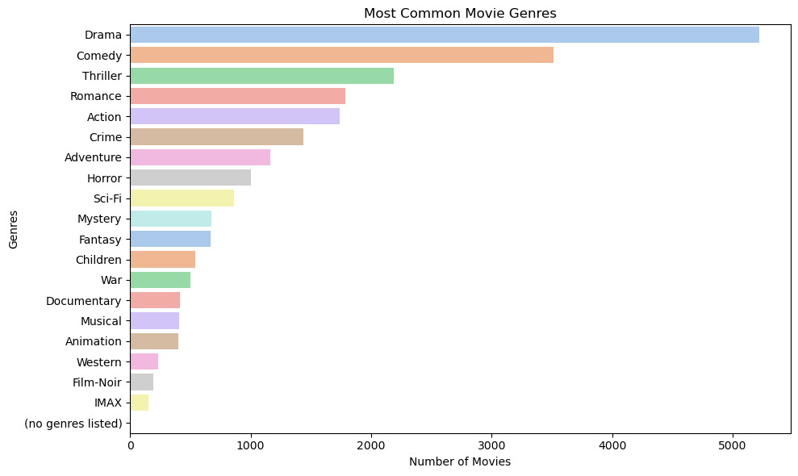
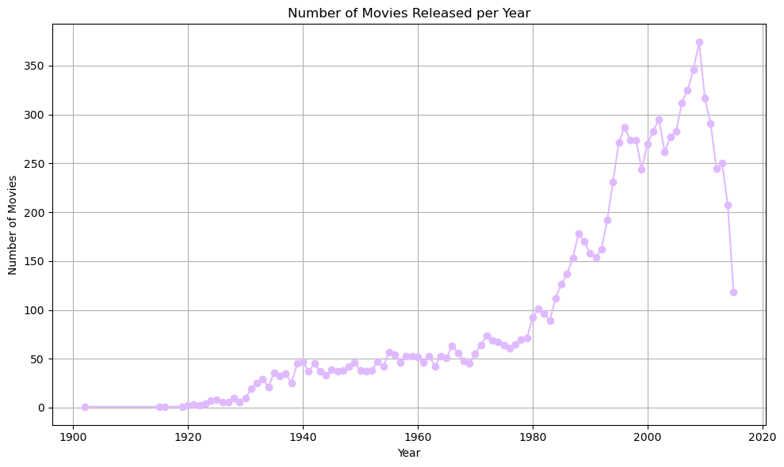
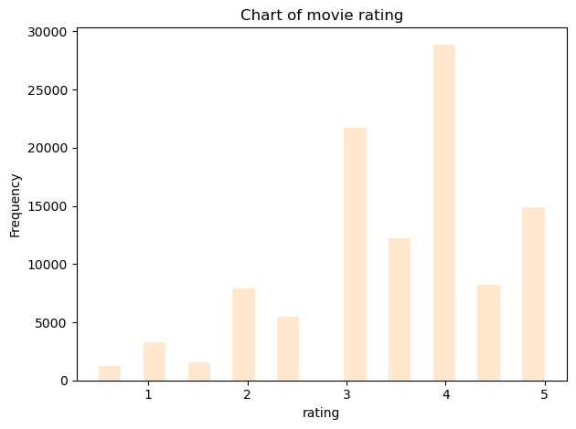

**Import libraries which are needed**


```python
import pandas as pd
```


```python
import seaborn as sns
```


```python
import numpy as np
```


```python
import matplotlib.pyplot as plt
```


```python
from collections import Counter

```


```python
from collections import Counter
```

**Importing data and show head of database**


```python
#importing the data
file_path = r"C:\Users\anick\Desktop\movies 1(in).csv"
Movie_df = pd.read_csv(file_path)
print(Movie_df.head())
```

       movieId                               title  \
    0        1                    Toy Story (1995)   
    1        2                      Jumanji (1995)   
    2        3             Grumpier Old Men (1995)   
    3        4            Waiting to Exhale (1995)   
    4        5  Father of the Bride Part II (1995)   
    
                                            genres  
    0  Adventure|Animation|Children|Comedy|Fantasy  
    1                   Adventure|Children|Fantasy  
    2                               Comedy|Romance  
    3                         Comedy|Drama|Romance  
    4                                       Comedy  
    


```python
import sys
print(sys.path)
```

    ['C:\\Users\\anick', 'C:\\Users\\anick\\Downloads\\ana\\python312.zip', 'C:\\Users\\anick\\Downloads\\ana\\DLLs', 'C:\\Users\\anick\\Downloads\\ana\\Lib', 'C:\\Users\\anick\\Downloads\\ana', '', 'C:\\Users\\anick\\Downloads\\ana\\Lib\\site-packages', 'C:\\Users\\anick\\Downloads\\ana\\Lib\\site-packages\\win32', 'C:\\Users\\anick\\Downloads\\ana\\Lib\\site-packages\\win32\\lib', 'C:\\Users\\anick\\Downloads\\ana\\Lib\\site-packages\\Pythonwin', 'C:\\Users\\anick\\Downloads\\ana\\Lib\\site-packages\\setuptools\\_vendor']
    


```python
import collections
print(collections.__file__)
```

    C:\Users\anick\Downloads\ana\Lib\collections\__init__.py
    


```python
from collections import Counter
```

**making  figure based on genres**


```python
genres_list = Movie_df["genres"].str.split("|").sum()
```

**getting an overview of measure of each column**


```python
genres_count = Counter(genres_list)
print(genres_count)
```

    Counter({'Drama': 5220, 'Comedy': 3515, 'Thriller': 2187, 'Romance': 1788, 'Action': 1737, 'Crime': 1440, 'Adventure': 1164, 'Horror': 1001, 'Sci-Fi': 860, 'Mystery': 675, 'Fantasy': 670, 'Children': 540, 'War': 503, 'Documentary': 415, 'Musical': 409, 'Animation': 401, 'Western': 235, 'Film-Noir': 195, 'IMAX': 152, '(no genres listed)': 7})
    

**using genres based on their count to find out which genres are more popular**


```python
genres_df = pd.DataFrame(genres_count.items(), columns=['Genres', 'Count'])
```


```python
genres_df = genres_df.sort_values(by='Count', ascending=False)
```


```python
custom_pastel_colors = ['#FFB3BA', '#FFDFBA', '#FFFFBA', '#BAFFC9', '#BAE1FF', '#E0BAFF', '#FFBAED']
```


```python
num_genres = len(genres_df)
```


```python
custom_pastel_colors = sns.color_palette("pastel", num_genres)
```


```python
plt.figure(figsize=(10, 6))
sns.barplot(data=genres_df, x='Count', y='Genres',hue='Genres', palette=custom_pastel_colors)
plt.title('Most Common Movie Genres')
plt.xlabel('Number of Movies')
plt.ylabel('Genres')
plt.tight_layout()
plt.show()
```


    

    


```python
Movie_df['year'] = Movie_df['title'].str.extract(r'\((\d{4})\)', expand=False)
Movie_df['year'] = pd.to_numeric(Movie_df['year'], errors='coerce')
```


```python
# Plot a line chart for movies released per year
Movie_per_year = Movie_df['year'].value_counts().sort_index()
plt.figure(figsize=(10, 6))
plt.plot(Movie_per_year.index, Movie_per_year.values, marker='o', color= '#E0BAFF')
plt.title('Number of Movies Released per Year')
plt.xlabel('Year')
plt.ylabel('Number of Movies')
plt.grid()
plt.tight_layout()
plt.show()
```


    

    


**Rating chart**


```python
plt.figure(figsize=(10,6))
```


    <Figure size 1000x600 with 0 Axes>


    <Figure size 1000x600 with 0 Axes>


```python
file_path = r"C:\Users\anick\Desktop\ezgi\ratings.csv"
rating_data = pd.read_csv(file_path)
print(rating_data.head())
```

       userId  movieId  rating   timestamp
    0       1       16     4.0  1217897793
    1       1       24     1.5  1217895807
    2       1       32     4.0  1217896246
    3       1       47     4.0  1217896556
    4       1       50     4.0  1217896523
    


```python
rating_distribution = rating_data["rating"]
```


```python
pastel_colors = sns.color_palette("pastel")
```


```python
rating_distribution.plot(kind="hist", bins=20, alpha=0.7, color='#FFDFBA')
plt.title("Chart of movie rating")
plt.xlabel("rating")
plt.ylabel("Frequency")
plt.tight_layout()
plt.show()

```


    

    


**Merging two database**


```python
merged_data= pd.merge(Movie_df, rating_data , on= "movieId")
```


```python
grouped_data= merged_data.groupby(["movieId","title"])
```


```python
movie_state= grouped_data["rating"].agg(["mean","count"])
```


```python
column_rename_mapping={
    "mean" : "average_rating",
    "count" : "rating_count"
}
```


```python
movie_state = movie_state.rename(columns={'mean': 'average_rating', 'count': 'rating_count'})

```


```python
top_rated_movies = movie_state.query("rating_count >= 10").sort_values("average_rating", ascending=False)
top_rated_movies.head()

```


<div>
<style scoped>
    .dataframe tbody tr th:only-of-type {
        vertical-align: middle;
    }

    .dataframe tbody tr th {
        vertical-align: top;
    }

    .dataframe thead th {
        text-align: right;
    }
</style>
<table border="1" class="dataframe">
  <thead>
    <tr style="text-align: right;">
      <th></th>
      <th></th>
      <th>average_rating</th>
      <th>rating_count</th>
    </tr>
    <tr>
      <th>movieId</th>
      <th>title</th>
      <th></th>
      <th></th>
    </tr>
  </thead>
  <tbody>
    <tr>
      <th>1730</th>
      <th>Kundun (1997)</th>
      <td>4.500000</td>
      <td>10</td>
    </tr>
    <tr>
      <th>1927</th>
      <th>All Quiet on the Western Front (1930)</th>
      <td>4.500000</td>
      <td>13</td>
    </tr>
    <tr>
      <th>1178</th>
      <th>Paths of Glory (1957)</th>
      <td>4.500000</td>
      <td>19</td>
    </tr>
    <tr>
      <th>7099</th>
      <th>Nausicaä of the Valley of the Wind (Kaze no tani no Naushika) (1984)</th>
      <td>4.477273</td>
      <td>22</td>
    </tr>
    <tr>
      <th>1248</th>
      <th>Touch of Evil (1958)</th>
      <td>4.476190</td>
      <td>21</td>
    </tr>
  </tbody>
</table>
</div>


```python

```
